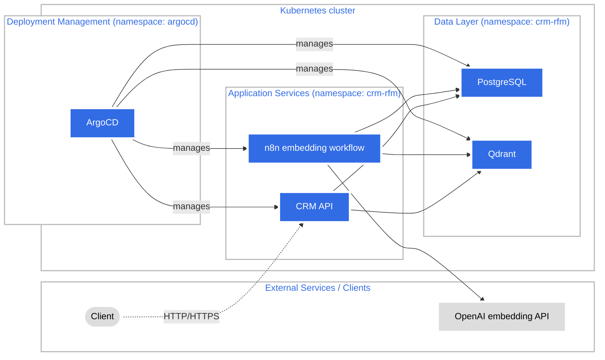

# Architecture

This document describes the infrastructure layout for the project **"RFM Analysis Using Artificial Intelligence in a CRM Application Deployed on the Kubernetes Platform."**  
The goal is to show which services run inside Kubernetes and which ones are external (frontend and AI/embeddings provider).

---

## System Architecture

---

## Components

### Internal Services (Kubernetes)

**Deployment Management:**
- **ArgoCD** – GitOps continuous delivery tool managing all application deployments and configurations.

**Application Services:**
- **CRM API** – backend service (from the separate repo: https://github.com/DawidAdamski/engineering-work-crm) deployed in this cluster; talks to PostgreSQL and Qdrant.
- **n8n embedding workflow** – automation running in Kubernetes; periodically reads customers from PostgreSQL, calls the external OpenAI embedding API, and upserts vectors into Qdrant.

**Data Layer:**
- **PostgreSQL** – relational database for CRM entities and classical RFM analysis.
- **Qdrant** – vector database that stores customer embeddings for AI-based segmentation and similarity search.

### External Services

- **Client** – external HTTP client (can be a browser, mobile app, or API client) that calls the CRM API through an ingress or port-forward.
- **OpenAI embedding API** – external AI provider that returns embeddings over HTTPS.

---

## Notes

- Application services (PostgreSQL, Qdrant, n8n, CRM API) are placed in the namespace: `crm-rfm`.
- **ArgoCD** runs in its own namespace `argocd` and manages all application deployments using GitOps principles, ensuring declarative and version-controlled infrastructure.
- In Minikube you can expose the CRM API with an Ingress so external clients can reach it.
- The external AI provider (OpenAI) can be swapped for any HTTP-compatible embedding service.