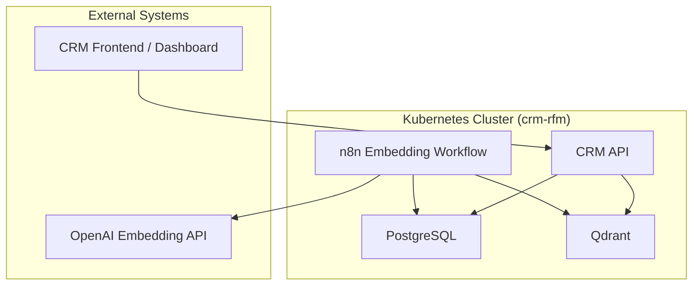

# Deployment Guide

This document describes how to deploy the **RFM Analysis Using Artificial Intelligence in a CRM Application Deployed on the Kubernetes Platform** infrastructure on a local **Minikube** cluster.

It covers initialization, applying Kubernetes manifests, configuring environment variables, and validating component health.

---

## 1. Prerequisites

Before deploying, ensure the following are installed on your workstation:

|Tool|Purpose|Recommended Version|
|:--|:--|:--|
|[Minikube](https://minikube.sigs.k8s.io/docs/)|Local Kubernetes cluster|≥ 1.33|
|[kubectl](https://kubernetes.io/docs/tasks/tools/)|Kubernetes CLI|≥ 1.30|
|[Helm](https://helm.sh/docs/)|Optional for packaged charts|≥ 3.14|
|[Docker](https://docs.docker.com/)|Image building and runtime|≥ 25|
|[curl / jq](https://stedolan.github.io/jq/)|Testing and JSON parsing|Latest|

---

## 2. Start Minikube

```bash
minikube start --cpus=4 --memory=8192 --driver=docker
```

**Note**: Services are configured as **NodePort** for direct access without port-forward.  
For Ingress-based access, install nginx-ingress manually (see [Service Access Guide](README.service-access.md)).

---

## 3. Create Namespace

```bash
kubectl create namespace crm-rfm
```
All following resources will reside in this namespace.

---

## 4. Apply Core Resources

### 4.1 ConfigMaps and Secrets

```bash
kubectl apply -f k8s/configmaps.yaml -n crm-rfm
kubectl apply -f k8s/secrets.yaml -n crm-rfm
```

### 4.2 Persistent Volumes

```bash
kubectl apply -f k8s/pvcs.yaml -n crm-rfm
```

### 4.3 Database and Vector Store

```bash
kubectl apply -f k8s/postgres.yaml -n crm-rfm
kubectl apply -f k8s/qdrant.yaml -n crm-rfm
```

### 4.4 n8n Embedding Worker

```bash
kubectl apply -f k8s/n8n.yaml -n crm-rfm
```

### 4.5 CRM API

```bash
kubectl apply -f k8s/crm-api.yaml -n crm-rfm
```

---

## 5. Access Services

### Option A: Direct Access via NodePort (No Setup Required)

All services are exposed as NodePort. Get Minikube IP and access directly:

```bash
# Get Minikube IP
minikube ip

# Access services
# CRM API: http://$(minikube ip):30080
# n8n: http://$(minikube ip):30678
# Qdrant: http://$(minikube ip):30333
```

### Option B: Ingress with Manual nginx-ingress

1. **Install nginx-ingress controller** (not via addon):
   ```bash
   kubectl apply -f k8s/nginx-ingress-controller.yaml
   kubectl wait --namespace ingress-nginx \
     --for=condition=ready pod \
     --selector=app.kubernetes.io/component=controller \
     --timeout=300s
   ```

2. **Apply Ingress**:
   ```bash
   kubectl apply -f k8s/ingress.yaml -n crm-rfm
   ```

3. **Add local DNS entry**:
   ```
   <minikube-ip>  crm.local
   ```

4. **Access via Ingress**:
   - CRM API → `http://crm.local` or `http://$(minikube ip):30000`

See [Service Access Guide](README.service-access.md) for detailed instructions.

---

## 6. Verify Component Health

### Check Pods

```bash
kubectl get pods -n crm-rfm
```

Expected output:

```
NAME                          READY   STATUS    RESTARTS   AGE
postgres-0                    1/1     Running   0          1m
qdrant-0                      1/1     Running   0          1m
n8n-deployment-5f9d5b9c6f-abcde   1/1   Running   0   30s
crm-api-deployment-6fd8cfbb7c-xyz12  1/1   Running   0   30s
```

### Check Services

```bash
kubectl get svc -n crm-rfm
```

### Access Services

Services are accessible via NodePort (no port-forward needed):

```bash
# CRM API
curl http://$(minikube ip):30080/health

# n8n UI
open http://$(minikube ip):30678

# Qdrant
curl http://$(minikube ip):30333/collections
```

See [Service Access Guide](README.service-access.md) for more details.

---

## 7. Populate Test Data

You can initialize fake CRM data directly in PostgreSQL:

```bash
kubectl exec -it deploy/postgres -n crm-rfm -- psql -U crmuser -d crmdb
```

```sql
INSERT INTO customers (name, total_spent, last_order_at)
VALUES
('Alice', 200.50, NOW() - INTERVAL '10 days'),
('Bob', 540.00, NOW() - INTERVAL '40 days'),
('Charlie', 1200.00, NOW() - INTERVAL '90 days');
```

The n8n workflow will automatically detect these new customers and generate embeddings.

---

## 8. Validate AI Integration

### Check n8n Logs

```bash
kubectl logs deploy/n8n -n crm-rfm
```

Expected lines:

```
[Workflow] Generating embedding for customer Alice
[Workflow] Upserted vector to Qdrant (id=1)
```

### Verify in Qdrant

```bash
curl http://$(minikube ip):$(kubectl get svc qdrant -n crm-rfm -o jsonpath='{.spec.ports[0].nodePort}')/collections
```

---

## 9. Stop or Delete

### Pause Cluster

```bash
minikube stop
```

### Delete Everything

```bash
kubectl delete namespace crm-rfm
minikube delete
```

---

## 10. Troubleshooting

| Issue | Possible Cause | Fix |
|:--|:--|:--|
| Pod stuck in CrashLoopBackOff | ConfigMap or Secret missing | Check `kubectl describe pod` |
| Cannot access services via NodePort | Minikube not running or firewall blocking | Check `minikube status`, verify firewall rules |
| Ingress not working | nginx-ingress not installed or DNS not configured | Install nginx-ingress, check `/etc/hosts` entry |
| Embeddings not created | OpenAI key invalid or network blocked | Check n8n logs for API errors |
| Qdrant empty | Workflow not triggered | Run n8n manually via its UI |

---

## Deployment Topology Summary

