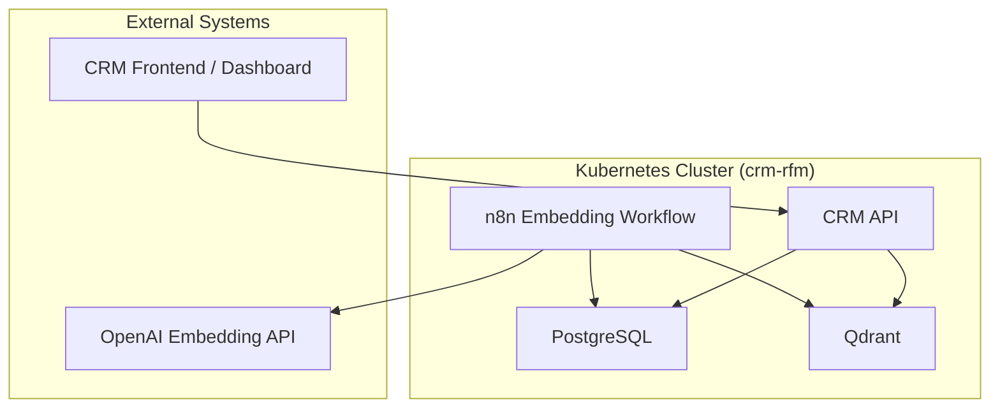

# Deployment Guide

This document describes how to deploy the **RFM Analysis Using Artificial Intelligence in a CRM Application Deployed on the Kubernetes Platform** infrastructure on a local **Minikube** cluster.

It covers initialization, applying Kubernetes manifests, configuring environment variables, and validating component health.

---

## 1. Prerequisites

Before deploying, ensure the following are installed on your workstation:

|Tool|Purpose|Recommended Version|
|:--|:--|:--|
|[Minikube](https://minikube.sigs.k8s.io/docs/)|Local Kubernetes cluster|≥ 1.33|
|[kubectl](https://kubernetes.io/docs/tasks/tools/)|Kubernetes CLI|≥ 1.30|
|[Helm](https://helm.sh/docs/)|Optional for packaged charts|≥ 3.14|
|[Docker](https://docs.docker.com/)|Image building and runtime (required for Docker driver)|≥ 25|
|[Hyper-V](https://docs.microsoft.com/en-us/virtualization/hyper-v-on-windows/)|Virtualization platform (required for Hyper-V driver on Windows)|Windows 10/11 Pro/Enterprise|
|[curl / jq](https://stedolan.github.io/jq/)|Testing and JSON parsing|Latest|

---

## 2. Start Minikube

### Option A: Docker Driver (Default)

```bash
minikube start --cpus=4 --memory=8192 --driver=docker
```

### Option B: Hyper-V Driver (Windows)

For Windows with Hyper-V, use:

```bash
minikube start --driver=hyperv --container-runtime=cri-o --cpus=2 --memory=4g --nodes 3 -v 7 --alsologtostderr --hyperv-virtual-switch="Packer-Switch"
```

**Note**: 
- For service access without port-forward, we recommend using **MetalLB** (see Section 5).  
- Services are configured as **NodePort** by default, but can be switched to **LoadBalancer** with MetalLB.
- When using Hyper-V, ensure your MetalLB IP pool matches the Minikube subnet (see Section 5.2).

---

## 3. Create Namespace

```bash
kubectl create namespace crm-rfm
```
All following resources will reside in this namespace.

---

## 4. Apply Core Resources

### 4.1 ConfigMaps and Secrets

```bash
kubectl apply -f k8s/configmaps.yaml -n crm-rfm
kubectl apply -f k8s/secrets.yaml -n crm-rfm
```

### 4.2 Persistent Volumes

```bash
kubectl apply -f k8s/pvcs.yaml -n crm-rfm
```

### 4.3 Database and Vector Store

```bash
kubectl apply -f k8s/postgres.yaml -n crm-rfm
kubectl apply -f k8s/qdrant.yaml -n crm-rfm
```

### 4.4 n8n Embedding Worker

```bash
kubectl apply -f k8s/n8n.yaml -n crm-rfm
```

### 4.5 CRM API

```bash
kubectl apply -f k8s/crm-api.yaml -n crm-rfm
```

---

## 5. Access Services

### Recommended: LoadBalancer with MetalLB (No Port-Forward Required)

**MetalLB** provides LoadBalancer services in bare-metal Kubernetes, making services accessible without port-forward or Minikube addons.

1. **Install MetalLB**:
   ```bash
   kubectl apply -f https://raw.githubusercontent.com/metallb/metallb/v0.15.2/config/manifests/metallb-native.yaml
   kubectl wait --namespace metallb-system \
     --for=condition=ready pod \
     --selector=app=metallb \
     --timeout=90s
   ```

2. **Configure IP pool**:
   ```bash
   # Get Minikube IP to determine subnet
   MINIKUBE_IP=$(minikube ip)
   echo "Minikube IP: $MINIKUBE_IP"
   
   # Edit k8s/metallb-config.yaml with IP range in same subnet
   # Examples:
   #   - If Minikube IP is 192.168.0.40 (Hyper-V), use 192.168.0.200-192.168.0.210
   #   - If Minikube IP is 192.168.49.2 (VirtualBox), use 192.168.49.100-192.168.49.200
   #   - If Minikube IP is 172.17.0.2 (Docker), use 172.17.0.100-172.17.0.200
   
   kubectl apply -f k8s/metallb-config.yaml
   ```

3. **Replace NodePort services with LoadBalancer services**:
   ```bash
   kubectl apply -f k8s/services-loadbalancer.yaml -n crm-rfm
   ```

4. **Verify and access services**:
   ```bash
   # Check assigned external IPs
   kubectl get svc -n crm-rfm
   
   # Example output:
   # NAME       TYPE           CLUSTER-IP      EXTERNAL-IP      PORT(S)
   # crm-api    LoadBalancer   10.96.1.2       172.17.0.100     8000:30080/TCP
   # n8n        LoadBalancer   10.96.1.3       172.17.0.101     5678:30678/TCP
   # qdrant     LoadBalancer   10.96.1.4       172.17.0.102      6333:30333/TCP,6334:30334/TCP
   
   # Access services directly via external IPs:
   curl http://172.17.0.100:8000/health  # CRM API
   open http://172.17.0.101:5678         # n8n UI
   curl http://172.17.0.102:6333/collections  # Qdrant
   ```

### Alternative: Direct Access via NodePort

If you prefer not to use MetalLB, services are exposed as NodePort:

```bash
# Get Minikube IP
minikube ip

# Access services
# CRM API: http://$(minikube ip):30080
# n8n: http://$(minikube ip):30678
# Qdrant: http://$(minikube ip):30333
```

### Alternative: Ingress with Manual nginx-ingress

For domain-based routing, see [Service Access Guide](README.service-access.md) for Ingress setup.

See [Service Access Guide](README.service-access.md) for detailed instructions and troubleshooting.

---

## 6. Verify Component Health

### Check Pods

```bash
kubectl get pods -n crm-rfm
```

Expected output:

```
NAME                          READY   STATUS    RESTARTS   AGE
postgres-0                    1/1     Running   0          1m
qdrant-0                      1/1     Running   0          1m
n8n-deployment-5f9d5b9c6f-abcde   1/1   Running   0   30s
crm-api-deployment-6fd8cfbb7c-xyz12  1/1   Running   0   30s
```

### Check Services

```bash
kubectl get svc -n crm-rfm
```

### Access Services

If using MetalLB (recommended), services are accessible via their external IPs:

```bash
# Get service external IPs
kubectl get svc -n crm-rfm

# Access services (replace IPs with your assigned external IPs)
curl http://<crm-api-external-ip>:8000/health
open http://<n8n-external-ip>:5678
curl http://<qdrant-external-ip>:6333/collections
```

If using NodePort, access via Minikube IP:

```bash
# CRM API
curl http://$(minikube ip):30080/health

# n8n UI
open http://$(minikube ip):30678

# Qdrant
curl http://$(minikube ip):30333/collections
```

See [Service Access Guide](README.service-access.md) for more details.

---

## 7. Populate Test Data

You can initialize fake CRM data directly in PostgreSQL:

```bash
kubectl exec -it postgres-0 -n crm-rfm -- psql -U crmuser -d crmdb
```

```sql
INSERT INTO customers (name, total_spent, last_order_at)
VALUES
('Alice', 200.50, NOW() - INTERVAL '10 days'),
('Bob', 540.00, NOW() - INTERVAL '40 days'),
('Charlie', 1200.00, NOW() - INTERVAL '90 days');
```

The n8n workflow will automatically detect these new customers and generate embeddings.

---

## 8. Validate AI Integration

### Check n8n Logs

```bash
kubectl logs deploy/n8n -n crm-rfm
```

Expected lines:

```
[Workflow] Generating embedding for customer Alice
[Workflow] Upserted vector to Qdrant (id=1)
```

### Verify in Qdrant

```bash
curl http://$(minikube ip):$(kubectl get svc qdrant -n crm-rfm -o jsonpath='{.spec.ports[0].nodePort}')/collections
```

---

## 9. Stop or Delete

### Pause Cluster

```bash
minikube stop
```

### Delete Everything

```bash
kubectl delete namespace crm-rfm
minikube delete
```

---

## 10. Troubleshooting

| Issue | Possible Cause | Fix |
|:--|:--|:--|
| Pod stuck in CrashLoopBackOff | ConfigMap or Secret missing | Check `kubectl describe pod` |
| Cannot access services via LoadBalancer | MetalLB not installed or IP pool misconfigured | Install MetalLB, verify IP pool matches Minikube subnet (see Section 5) |
| LoadBalancer stuck in Pending | MetalLB not ready or IP pool exhausted | Check `kubectl get pods -n metallb-system`, verify IP pool range |
| Cannot access services via NodePort | Minikube not running or firewall blocking | Check `minikube status`, verify firewall rules |
| Ingress not working | nginx-ingress not installed or DNS not configured | Install nginx-ingress, check `/etc/hosts` entry |
| Embeddings not created | OpenAI key invalid or network blocked | Check n8n logs for API errors |
| Qdrant empty | Workflow not triggered | Run n8n manually via its UI |

---

## Deployment Topology Summary

