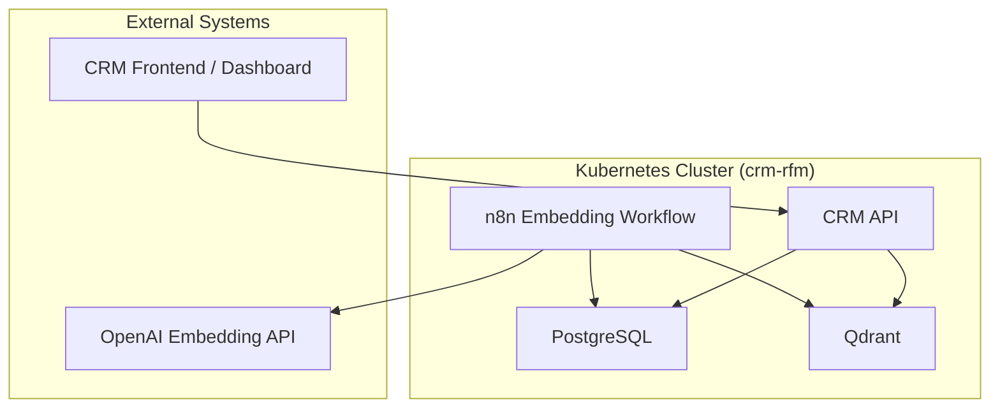

# Deployment Guide

This document describes how to deploy the **RFM Analysis Using Artificial Intelligence in a CRM Application Deployed on the Kubernetes Platform** infrastructure on a local **Minikube** cluster.

It covers initialization, applying Kubernetes manifests, configuring environment variables, and validating component health.

---

## 1. Prerequisites

Before deploying, ensure the following are installed on your workstation:

|Tool|Purpose|Recommended Version|
|:--|:--|:--|
|[Minikube](https://minikube.sigs.k8s.io/docs/)|Local Kubernetes cluster|≥ 1.33|
|[kubectl](https://kubernetes.io/docs/tasks/tools/)|Kubernetes CLI|≥ 1.30|
|[Helm](https://helm.sh/docs/)|Optional for packaged charts|≥ 3.14|
|[Docker](https://docs.docker.com/)|Image building and runtime|≥ 25|
|[curl / jq](https://stedolan.github.io/jq/)|Testing and JSON parsing|Latest|

---

## 2. Start Minikube

```bash
minikube start --cpus=4 --memory=8192 --driver=docker
```

**Note:** Services are exposed via **NodePort** (no addons required). See [Accessing Services](#5-accessing-services) section below.

---

## 3. Create Namespace

```bash
kubectl create namespace crm-rfm
```
All following resources will reside in this namespace.

---

## 4. Apply Core Resources

### 4.1 ConfigMaps and Secrets

```bash
kubectl apply -f k8s/configmaps.yaml -n crm-rfm
kubectl apply -f k8s/secrets.yaml -n crm-rfm
```

### 4.2 Persistent Volumes

```bash
kubectl apply -f k8s/pvcs.yaml -n crm-rfm
```

### 4.3 Database and Vector Store

```bash
kubectl apply -f k8s/postgres.yaml -n crm-rfm
kubectl apply -f k8s/qdrant.yaml -n crm-rfm
```

### 4.4 n8n Embedding Worker

```bash
kubectl apply -f k8s/n8n.yaml -n crm-rfm
```

### 4.5 CRM API

```bash
kubectl apply -f k8s/crm-api.yaml -n crm-rfm
```

---

## 5. Accessing Services

Services are exposed via **NodePort** and can be accessed directly without port-forwarding or addons.

### 5.1 Get Minikube IP Address

```bash
minikube ip
```

This will output the Minikube node IP (e.g., `192.168.49.2`).

### 5.2 Access Services via NodePort

All services use fixed NodePort assignments for easy access:

| Service | NodePort | Access URL |
|:--|:--|:--|
| **CRM API** | `30080` | `http://$(minikube ip):30080` |
| **n8n** | `30567` | `http://$(minikube ip):30567` |
| **Qdrant REST** | `30333` | `http://$(minikube ip):30333` |
| **Qdrant gRPC** | `30334` | `http://$(minikube ip):30334` |
| **PostgreSQL** | Internal only (ClusterIP) | Access via `kubectl exec` |

**Example commands:**

```bash
# Get Minikube IP
MINIKUBE_IP=$(minikube ip)

# Access CRM API
curl http://${MINIKUBE_IP}:30080/health

# Access n8n UI (open in browser)
echo "n8n UI: http://${MINIKUBE_IP}:30567"

# Access Qdrant REST API
curl http://${MINIKUBE_IP}:30333/collections
```

### 5.3 Optional: Ingress with Manual Controller

If you prefer using Ingress (with hostnames like `crm.local`), you can install an Ingress controller manually:

**Install NGINX Ingress Controller (without Minikube addon):**

```bash
kubectl apply -f https://raw.githubusercontent.com/kubernetes/ingress-nginx/controller-v1.11.1/deploy/static/provider/cloud/deploy.yaml
```

Wait for the controller to be ready:

```bash
kubectl wait --namespace ingress-nginx \
  --for=condition=ready pod \
  --selector=app.kubernetes.io/component=controller \
  --timeout=90s
```

Then apply the Ingress resource:

```bash
kubectl apply -f k8s/ingress.yaml -n crm-rfm
```

Add to `/etc/hosts` (or `C:\Windows\System32\drivers\etc\hosts` on Windows):

```
$(minikube ip) crm.local
```

Access via: `http://crm.local`

---

## 6. Verify Component Health

### Check Pods

```bash
kubectl get pods -n crm-rfm
```

Expected output:

```
NAME                          READY   STATUS    RESTARTS   AGE
postgres-0                    1/1     Running   0          1m
qdrant-0                      1/1     Running   0          1m
n8n-deployment-5f9d5b9c6f-abcde   1/1   Running   0   30s
crm-api-deployment-6fd8cfbb7c-xyz12  1/1   Running   0   30s
```

### Check Services

```bash
kubectl get svc -n crm-rfm
```

### Verify Service Access

Check that services are accessible via NodePort:

```bash
# Get Minikube IP
MINIKUBE_IP=$(minikube ip)

# Test CRM API
curl http://${MINIKUBE_IP}:30080/health

# Test Qdrant
curl http://${MINIKUBE_IP}:30333/collections
```

---

## 7. Populate Test Data

You can initialize fake CRM data directly in PostgreSQL:

```bash
kubectl exec -it deploy/postgres -n crm-rfm -- psql -U crmuser -d crmdb
```

```sql
INSERT INTO customers (name, total_spent, last_order_at)
VALUES
('Alice', 200.50, NOW() - INTERVAL '10 days'),
('Bob', 540.00, NOW() - INTERVAL '40 days'),
('Charlie', 1200.00, NOW() - INTERVAL '90 days');
```

The n8n workflow will automatically detect these new customers and generate embeddings.

---

## 8. Validate AI Integration

### Check n8n Logs

```bash
kubectl logs deploy/n8n -n crm-rfm
```

Expected lines:

```
[Workflow] Generating embedding for customer Alice
[Workflow] Upserted vector to Qdrant (id=1)
```

### Verify in Qdrant

```bash
MINIKUBE_IP=$(minikube ip)
curl http://${MINIKUBE_IP}:30333/collections
```

---

## 9. Stop or Delete

### Pause Cluster

```bash
minikube stop
```

### Delete Everything

```bash
kubectl delete namespace crm-rfm
minikube delete
```

---

## 10. Troubleshooting

| Issue | Possible Cause | Fix |
|:--|:--|:--|
| Pod stuck in CrashLoopBackOff | ConfigMap or Secret missing | Check `kubectl describe pod` |
| Cannot access services via NodePort | Firewall blocking ports or Minikube not running | Check `minikube status`, verify firewall rules |
| Services not accessible | NodePort not assigned | Check `kubectl get svc -n crm-rfm` for NodePort values |
| Embeddings not created | OpenAI key invalid or network blocked | Check n8n logs for API errors |
| Qdrant empty | Workflow not triggered | Run n8n manually via its UI |

---

## Deployment Topology Summary

