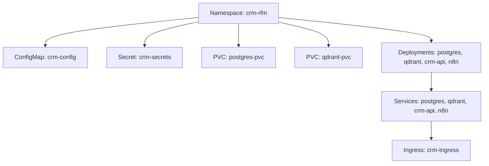

# Kubernetes Resources

This document describes the supporting Kubernetes resources that manage configuration, secrets, and network access for the **RFM Analysis Using Artificial Intelligence in a CRM Application Deployed on the Kubernetes Platform** project.

All services (PostgreSQL, Qdrant, CRM API, n8n) run inside a dedicated namespace.

---

## Namespace

All components are isolated in the namespace **`crm-rfm`**.

### Purpose
- Keep CRM-related resources grouped and separate from other workloads.
- Allow role-based access control (RBAC) and network policies at the namespace level.
- Simplify cleanup and redeployment.

### Command
```bash
kubectl create namespace crm-rfm
```

---

## ConfigMaps

ConfigMaps hold non-sensitive configuration for your deployments.

### Example: crm-config

```yaml
apiVersion: v1
kind: ConfigMap
metadata:
  name: crm-config
  namespace: crm-rfm
data:
  POSTGRES_DB: crmdb
  QDRANT_COLLECTION: customers
  OPENAI_MODEL: text-embedding-3-large
  WORKER_SCHEDULE: "0 * * * *"  # every hour
```

### Notes

- ConfigMaps are mounted as environment variables inside Pods.
- Suitable for model names, collection names, cron intervals, etc.
- Sensitive values (passwords, API keys) must not go here.

---

## Secrets

Secrets store confidential information like database credentials or API keys.

### Example: crm-secrets

```yaml
apiVersion: v1
kind: Secret
metadata:
  name: crm-secrets
  namespace: crm-rfm
type: Opaque
stringData:
  POSTGRES_USER: crmuser
  POSTGRES_PASSWORD: changeme
  OPENAI_API_KEY: sk-XXXXXX
```

### Notes

- Mount secrets as environment variables in Deployments:

```yaml
envFrom:
  - secretRef:
      name: crm-secrets
```

- Always keep `.yaml` files for secrets out of version control (add to `.gitignore`).

---

## Persistent Volumes (PVCs)

Persistent storage ensures that databases retain data across Pod restarts.

| Component | Mount Path | Claim Name | Size |
|:--|:--|:--|:--|
| PostgreSQL | `/var/lib/postgresql/data` | `postgres-pvc` | 5Gi |
| Qdrant | `/qdrant/storage` | `qdrant-pvc` | 5Gi |

### Example PVC

```yaml

apiVersion: v1
kind: PersistentVolumeClaim
metadata:
  name: postgres-pvc
  namespace: crm-rfm
spec:
  accessModes:
    - ReadWriteOnce
  resources:
    requests:
      storage: 5Gi
```

In Minikube, the default storage class provides local volumes automatically.

---

## Services

| Service | Type | Port | Internal Address |
|:--|:--|:--|:--|
| PostgreSQL | ClusterIP | `5432` | `postgres.crm-rfm.svc.cluster.local` |
| Qdrant | ClusterIP | `6333` | `qdrant.crm-rfm.svc.cluster.local` |
| CRM API | ClusterIP | `8000` | `crm-api.crm-rfm.svc.cluster.local` |
| n8n | ClusterIP | `5678` | `n8n.crm-rfm.svc.cluster.local` |

All services communicate internally using Kubernetes DNS.

---

## Ingress

In Minikube, Ingress provides local access to the CRM API (and optionally n8n UI).

### Example: crm-ingress

```yaml
apiVersion: networking.k8s.io/v1
kind: Ingress
metadata:
  name: crm-ingress
  namespace: crm-rfm
  annotations:
    nginx.ingress.kubernetes.io/rewrite-target: /
spec:
  ingressClassName: nginx
  rules:
    - host: crm.local
      http:
        paths:
          - path: /
            pathType: Prefix
            backend:
              service:
                name: crm-api
                port:
                  number: 8000
```

### Enable Ingress in Minikube

```bash
minikube addons enable ingress
```

Then edit your local `/etc/hosts`:

```
127.0.0.1 crm.local
```

You can now open `http://crm.local`.

---

## Resource Dependencies



---

## Notes

All manifests are designed to work with Minikube by default.

To deploy on production clusters, review:

Resource limits/requests

NetworkPolicies

TLS certificates (via cert-manager)

Use kubectl apply -f per component for iterative development.